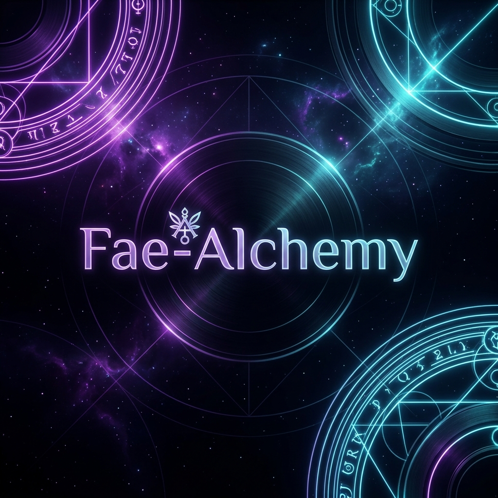

# 🌌 Fae-Alchemy

<p align="center">
  
</p>

<p align="center">
  <strong>Crafting premium, high-performance, and framework-agnostic FiveM resources.</strong>
</p>

<p align="center">
  <a href="https://discord.gg/your-discord-link"></a>
  <a href="https://github.com/Fae-Alchemy"></a>
</p>

---

### ✨ Who We Are

Welcome to **Fae-Alchemy**! We are a development collective dedicated to raising the standard of FiveM server resources. By blending modern UI/UX design with deep scripting abstractions, we build modular systems that are lightweight, secure, and incredibly easy to integrate.

Our core philosophy is **framework agnosticism**—our resources adapt dynamically to your server environment, whether you run **QBCore**, **ESX**, or a custom **Standalone** setup.

---

### 📦 The "Void" Ecosystem

Our flagship suite of scripts, built around a unified architecture to deliver seamless performance.

| Resource | Description | Key Features |
| :--- | :--- | :--- |
| [**`void_bridge`**](https://github.com/Fae-Alchemy/void_bridge) | 🌉 The backbone of our ecosystem. A framework-agnostic API wrapper. | • Dynamic auto-detection of QBCore/ESX/Standalone<br>• Unified Player, Society, and Inventory APIs<br>• Built-in thread-safe RPC callback system |
| [**`void_shops`**](https://github.com/Fae-Alchemy/void_shops) | 🏪 Premium dynamic shop system with a sleek, custom UI. | • Modern NUI Dashboard (HTML/CSS/JS)<br>• Job-owned society shops with persistent storage<br>• Cash, Bank, or Contraband payment options |
| [**`void_market`**](https://github.com/Fae-Alchemy/void_market) | 🕶️ Immersive Underground Black Market & Smuggling runs. | • Relocating Broker NPC with spook LEO mechanics<br>• High/Medium/Low difficulty smuggling runs with police tracking<br>• SQL-Free reputation progression and discounts |

---

### ⚙️ Core Integration Support

All Fae-Alchemy resources are designed to work out of the box with the most popular assets in the FiveM community:

- **Frameworks**: `QBCore` • `ESX` • `Standalone`
- **Inventories**: `ox_inventory` • `qb-inventory` • `qs-inventory`
- **Target Systems**: `ox_target` • `qb-target` • `qtarget`
- **Utility Libraries**: `ox_lib` • `qb-core` • `es_extended`

---

### 🚀 Getting Started

To get started with our ecosystem, the installation flow is straightforward:

1. Download and ensure **`void_bridge`** first in your `server.cfg`.
2. Install any of our companion scripts (e.g., `void_shops`, `void_market`) directly after it.
3. Enjoy an automatically configured, high-performance experience!

```cfg
ensure void_bridge
ensure void_shops
ensure void_market
```

---

<p align="center">
  <sub>Made with 💜 by Fae-Alchemy</sub>
</p>
